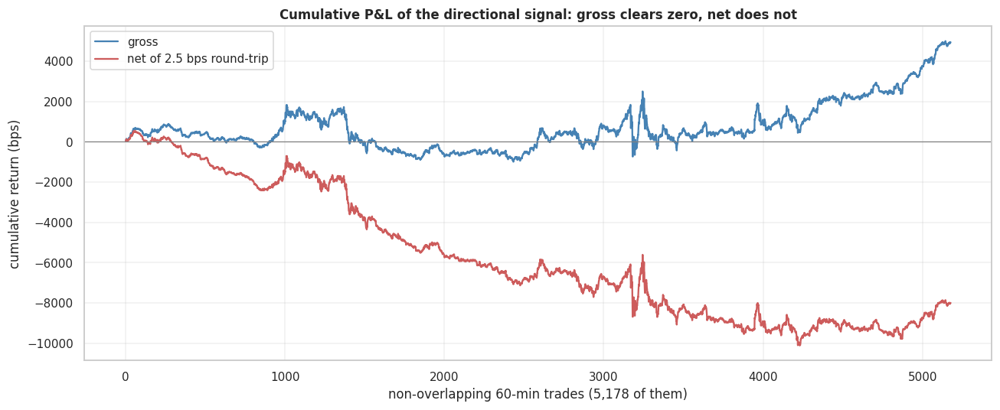
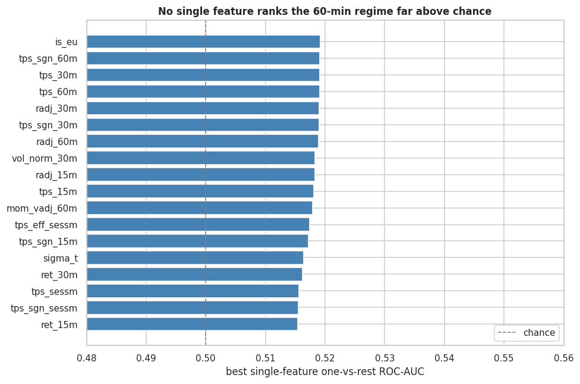

# Intraday Regime Classification in WTI Crude Oil Futures: Final Model

This is the modelling follow-up to my Module 20.1 EDA. The EDA built and cleaned
the data and ran a first baseline. Here I do the full modelling: three model
families, each grid-searched and cross-validated, tested out of sample across a
long walk-forward, and then put through a P&L net of trading costs.

## What this project does

I ask one question: can the next 60 minutes of WTI crude direction be predicted
from price, volatility, term-structure, open-interest and options signals? The
target is the project's three-state regime: UP, DOWN, MR (mean-reversion),
defined to spec from forward vol-adjusted return AND forward path efficiency
versus per-fold quantiles. NO_TRADE windows are dropped, so the model only learns
from clean examples.

For a desk the question is not "build a model". It is "is there an edge here, and
is it worth trading after costs". A small edge that the spread eats is not an
edge, and knowing that stops capital chasing it.

## Data

| | |
|---|---|
| Source | CME, 1-minute OHLCV (+ option-implied vol surface) |
| Window | 2010-06-06 → 2025-12-12 |
| Sessions | 3,942 |
| Bars | 5,280,818 (4,084,036 after roll-cleaning) |
| Features | 60 engineered |

The matrix ships as eight two-year parquet shards in `data/` (each under 100 MB,
686 MB total), so the notebook re-runs end to end on a clone, not only renders from
embedded outputs. It is assembled from an internal CME pipeline (build recipe kept
local). Slow features (term structure, open interest, the vol surface) are
end-of-session quantities carried at a one-session lag, the same information cadence
a desk has intraday.

## Method

- Models: multinomial logistic regression (L2), random forest, histogram gradient
  boosting (linear, bagged trees, boosted trees).
- Tuning: grid search with an expanding-window `TimeSeriesSplit`, on a held-out
  tuning block (history through 2012). No evaluation row is seen during tuning.
- Evaluation: walk-forward (12-month train, 1-month test, monthly step) across
  155 folds (2013-01 → 2025-12). Label thresholds recomputed per training fold.
- Metric: macro-F1 as the headline (equal weight on the three classes, so a model
  cannot win by riding the majority), with per-class / macro ROC-AUC as the
  threshold-free ranking measure and accuracy reported against the majority floor.

## Findings

There is a signal, but it is smaller than the spread.

All three tuned models land in the same place out of sample:

| Model | Accuracy | Macro-F1 | Macro ROC-AUC |
|---|---|---|---|
| Logistic regression | 0.362 | 0.357 | 0.534 |
| Random forest | 0.436 | 0.281 | 0.535 |
| Hist. gradient boosting | 0.389 | 0.354 | 0.530 |
| Majority-class floor | 0.445 | 0.205 | 0.500 |

Macro-AUC is about 0.53, a few points above chance. That gap is real, not noise:
across 155 folds the mean is 0.539 (95% CI [0.536, 0.542]) and a label-permutation
test puts the p-value at zero. But statistical significance is not an edge. Turned
into a long/short book, long on UP, short on DOWN, flat on MR, the signal earns
about **+0.9 bps per trade gross**, on a near-50% hit-rate, leaning on the short
side. That is smaller than the cost of trading it:

| Round-trip cost | Net per trade |
|---|---|
| 1.0 bps | −0.08 bps |
| 1.5 bps | −0.58 bps |
| 2.0 bps | −1.08 bps |
| 3.0 bps | −2.08 bps |

Net of even a one-tick round trip the edge is gone; at the 2-3 bps you actually
pay to cross in CL front month it is a clear loss. Gross, the equity curve climbs;
net, it rolls over.



No single feature carries the edge, the strongest ranks the regime at 0.519 AUC,
and permutation importance is near zero for every feature. The models only reach
0.53 by stacking many faint signals together.



### What it means

WTI front month is among the most efficient and most liquid markets in the world.
On a one-hour view it does not give its next move away for free: the little
directional information that exists is already priced to within transaction costs.
A linear model and two non-linear ensembles agreeing to the decimal says the
ceiling sits in the data, not in the estimator. The practical answer is a flat no:
do not run a 60-minute directional model on this data and expect to make money
after costs.

### Where an edge could still hide (next steps)

These are hypotheses, not results. This dataset cannot test them, which is the
point of listing them.

- Order book / L2 microstructure. On a 60-minute horizon the signal, if there is
  one, lives in the book: depth, queue imbalance, trade flow. A bar-level matrix
  throws all of that away. Rebuilding the features from L2 data is the first step.
- The macro context. WTI is not traded in isolation. It moves with equity vol
  (VIX), with refining margins (the crack spreads, RBOB and heating oil), with its
  grade basis (Brent-WTI), and with the dollar and rates. Adding these is the
  obvious second extension.
- Longer horizons. The slow features move day to day, not minute to minute; they
  may carry more at a one-day or one-week horizon.

## How to read it

Open [`capstone.ipynb`](capstone.ipynb): it reads top to bottom with all outputs
and figures embedded. To re-execute:

```
pip install -r requirements.txt
# the eight matrix shards already ship in data/
jupyter nbconvert --to notebook --execute capstone.ipynb --output capstone.ipynb
```

Full execution is under an hour on a 100-core workstation; the grid search and
walk-forward dominate. Figures are written to `images/` as they render.
